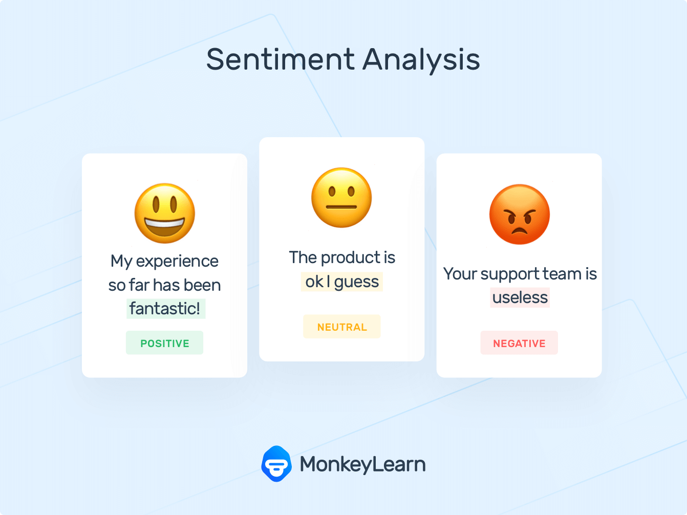
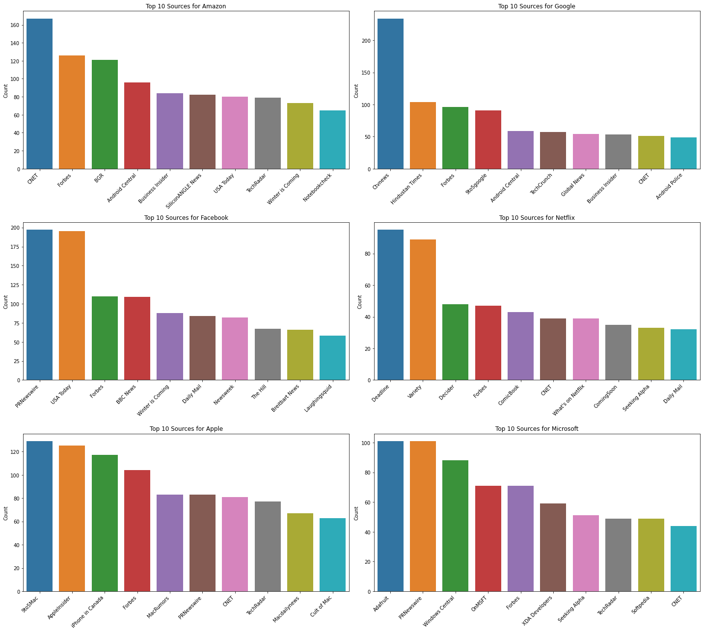
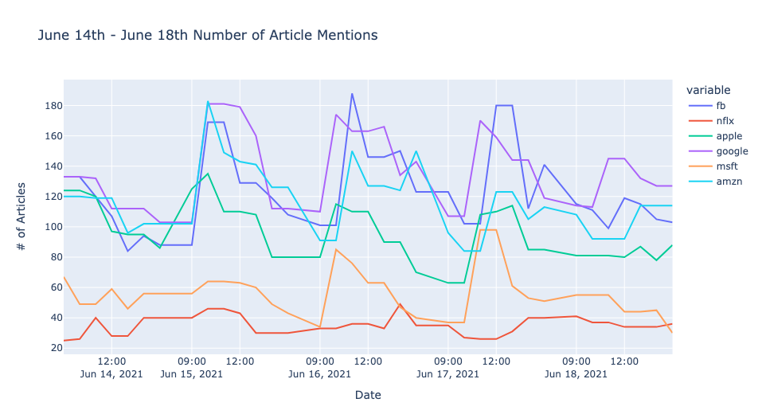
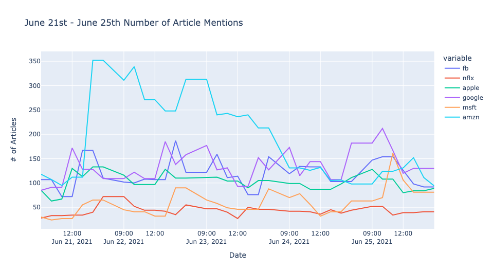
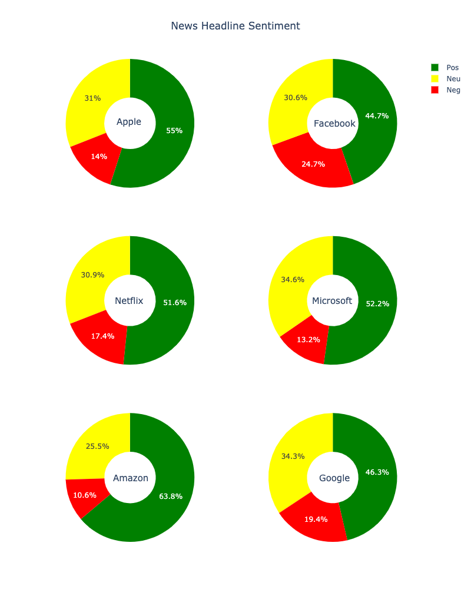
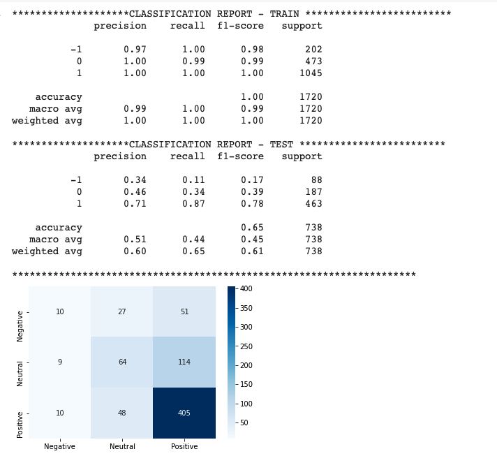
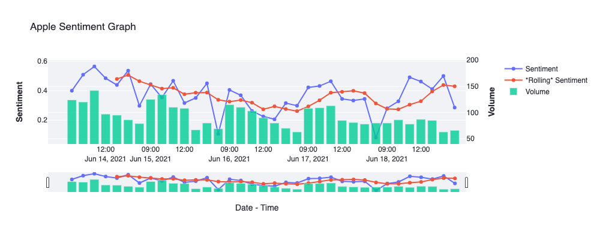
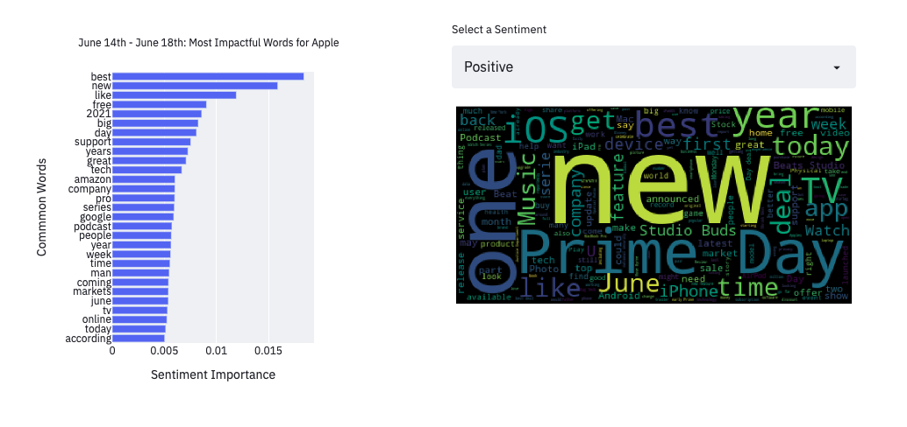
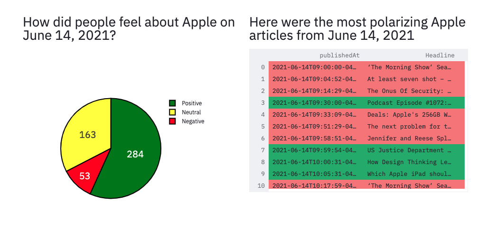

# Sentiment Tracker

Dashboard can be found [here](www.google.com)

----
**BUSINESS CASE**

Sentiment analysis is critical for understanding how customers, investors, and the general public feel about a companies brand. Companies are operating in an environment where anything less than a pristine image is detrimental. I have built a dashboard that shows companies how their public sentiment is changing on an hourly basis. They can use this data to make informed decisions on how to alter their public persona. 

**GOALS**

1. Import news articles with proper queries and filtering
2. Implement various unsupervised sentiment analysis models (VADER, TextBlob, FLAIR) to determine sentiment
3. Utilize classification models like Random Forests to create inferences
4. Deploy to a webapp using streamlit

**ROADMAP**

The goal of this project is to track the sentiment of major technology companies based on global news articles. I used the [newsapi](https://newsapi.org/) to source articles from around the world and filtered out those that did not provide meaningful content. Next, I used a [Kaggle financial](https://www.kaggle.com/ankurzing/sentiment-analysis-for-financial-news) news headlines  dataset to determine the best combination of unsupervised sentiment analysis models and landed on a combination of VADER and TextBlob. Then, I used this rules based model to approach to extract sentiment from the news headlines that I sourced and confidentially assigned each article a positive, neutral, or negative score. Finally, I used a Random Forest model to determine which specific words were most impactful in driving sentiment by extracting feature importance. Last, I built a dashboard on streamlit to display my findings. 

---------
# Extract, Transform, Load

ETL was performed using Python Requests package and the newsapi Python client. I decided to focus on FAANG companies + Microsoft. Newsapi has strict throttling limits and only allowed for 100 requests over a 24 hour period which prevented me from being able to stream live data. Additionally, results only span one month so I decided to focus on 2 weeks of data for 6 companies. 

Querried results by relevancy and manually sorted out 'bad sources.' Removed duplicates based on content and source and dropped null values. 'Content' of the article is limited to 200 characters so concatenated 'title', 'description' (summary of article) and 'content' so that unsupervised models would have more data to extract sentiment. 

*For details, please see this [notebook](https://github.com/kuninethan95/Sentiment_Tracker/blob/main/NLP_Modeling.ipynb) and this [notebook](https://github.com/kuninethan95/Sentiment_Tracker/blob/main/Data%20Gathering%20-%20NewsAPI%20%2B%20YFinanace.ipynb)*

-------
# Exploratory Data Analysis

*Analyzed the most common sources by company.*

- Netflix is mainly comprised of entertainment reporting (Deadline/Variety)
- Amazon/Google are mainly comprised of tech reporting
- Apple has a lot of Apple specific media outlets
- Microsoft is a combination of general tech and Microsoft specific
- Facebook is mainly political reports

*Tracked the number of mentions per hour*

- The mornings have the highest volume of news coverage and it slowly decreases as the day progresses
- In the first week, Netflix and Microsoft are on the lower range and the remaining companies are greater in volume by a magnitude of 2/2
- In the second week, Amazon begins very strong because of Amazon Prime Day and then falls into a more predictable pattern

*Analyzed Overall Sentiment Per Company*

- The plurality of all companies is positive sentiment, followed by neutral sentiment, followed by negative sentiment
- Amazon has the highest ratio of positive to negative sentiment
- Facebook has hte lowest positive sentiment and highest negative sentiment
- Microsoft has the greatest neutral sentiment
- The unsupervised learning model had challenges identifying neutral values and misinterpeted them as positive which may confound the results slighltly

*For details, please see this [notebook](https://github.com/kuninethan95/Sentiment_Tracker/blob/main/EDA.ipynb)*

# Opinion Mining

Used VADER and TextBlob to extract sentiment:

> [VADER](https://www.researchgate.net/publication/275828927_VADER_A_Parsimonious_Rule-based_Model_for_Sentiment_Analysis_of_Social_Media_Text): Lexicon and rule based model for sentiment analysis typically used to extract social media sentiment. Trained on social media content and retuns a score between -1 and 1 based on positivity vs. negativity

> [TextBlob](https://textblob.readthedocs.io/en/dev/advanced_usage.html#sentiment-analyzers): Rules based sentiment analysis model which uses NaiveBayesAnalyzer and is trained on a movie reviews corpus

Performed sentiment analysis on news articles using VADER and TextBlob. When both models had the same prediction, they were 67% accurate (predicting positive, negative, neutral sentiment) and 42% accurate (TextBlob) and 47% (VADER) accurate when they differed.

When VADER & TextBlob had the same result, I agreed with consensus and took the conclusion as accurate. When they differed, I created a rules based approach to reconcile. When their results differed, I looked at how much they differed by (0,2) and chose the VADER or TextBlob result based on how far off from each other they were. When they were very different, I opted for VADER. This improved accuracy from 56% to 60%.

*For details, please see this [notebook](https://github.com/kuninethan95/Sentiment_Tracker/blob/main/NLP_Modeling.ipynb)*

------
# NLP Using TF-IDF and Random Forest

Used sklearn TF-IDF vectorizer to pre-process text for classifcation models. Did not use CountVectorizer because TF-IDF is a more nuanced approach. Used a pipeline to alter the following:

> 1. Stop words: List of words eliminated because they have litte to no meaning for classification (ie prepositions)
> 2. Ngram Range: Number of n-grams to incorporate into TF-IDF Vectorizer (used unigrams and bigrams)
> 3. Max_df: Ignores terms that are present accross maximum threshold of documents
> 4. Min_df: Ignores terms that are present accross minimum threshold of documents
> 5. Tokenizer: Utilized NLTK RegExp tokenizer to handle contractions
> 6. Normalizer: Applied L1 or L2 normalization to reduce noise

Tested Random Forest and Logistic Regression to classify sentiment as positive, negative, or neutral (1, -1, 0). Dummy model had 40% accuracy and Random Forest Models had a test accuracy of 64%. Logistic regression performed slightly poorer at 62%. Negative recall was the most difficult type of sentiment to predict across the board. Positive recall was the most succesfull across the board. Pruned random forest model to reduce overfitting using: 

> 1. Max Depth: Maximum depth of tree
> 2. Minimum Sample Leaf: Minimum number of samples to to split an internal node

*For details, please see this [notebook](https://github.com/kuninethan95/Sentiment_Tracker/blob/main/NLP_Modeling.ipynb)*

------
# Dashboard

Allows user to choose to analyze the sentiment based off of news articles of either Apple, Facebook, Google, Microsoft, Netflix, or Amazon. They can look at the weeks of June 14th-18th or June 21st-25th (due to API limitations)

> Shows the average hourly sentiment, volume of news article, and a rolling average to reduce noise

Users can analyze which words are driving sentiment

> Can hone in on a positive, neutral, or negative sentiment to explore how news articles are impacting perception

Users can observe the most polarizing news headlines from the day

> These articles are either in top 90% quantile of most positive or bottom 10% quantile of most negative based on the unsupervised learning model

The purpose of the dashboard is to assist companies in understanding why users feel certain emotions toward their company or brand. Brands can observe what words are driving sentiment and if events are generating excess media attention. 

*For details, please see this [notebook](https://github.com/kuninethan95/Sentiment_Tracker/blob/main/Dashboard%20Prototype.ipynb)*

**FUTURE WORK**
1. Topic modeling using Latent Dirichlet Allocation to improve insights
2. Live stream news articles (would need to get around API request limits or use different API)
3. Extract opinions from social media sitess like Reddit, Twitter, & Facebook
4. Create API to add sentiment as an overlay for technical analysis for quantitative traders
5. Reduce overfit on Random Forest models